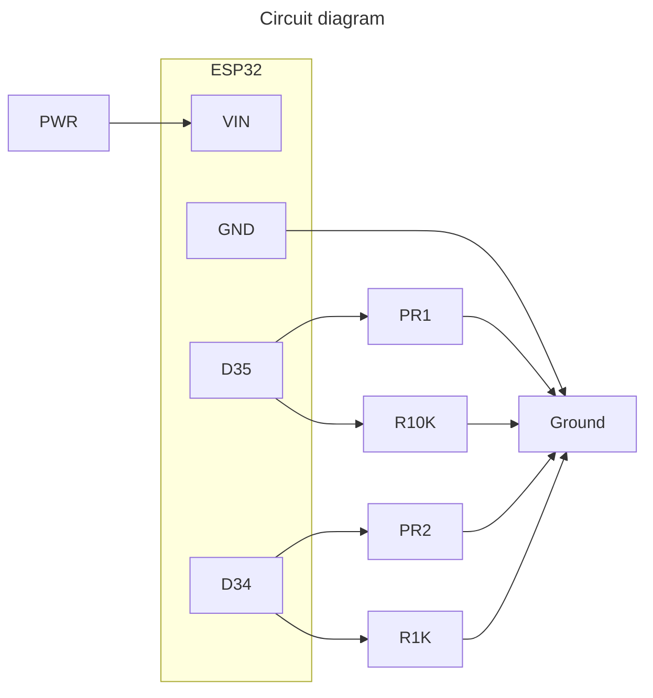

This project is meant to be run with an ESP32 in this circuit.

```mermaid
---
title: Circuit diagram
---

graph LR
	subgraph ESP32
	VIN
	GND
	D35
	D34
	end
	PWR-->VIN
	GND-->Ground
	D35-->PR1-->Ground
	D35-->R10K-->Ground
	D34-->PR2-->Ground
	D34-->R1K-->Ground
```
