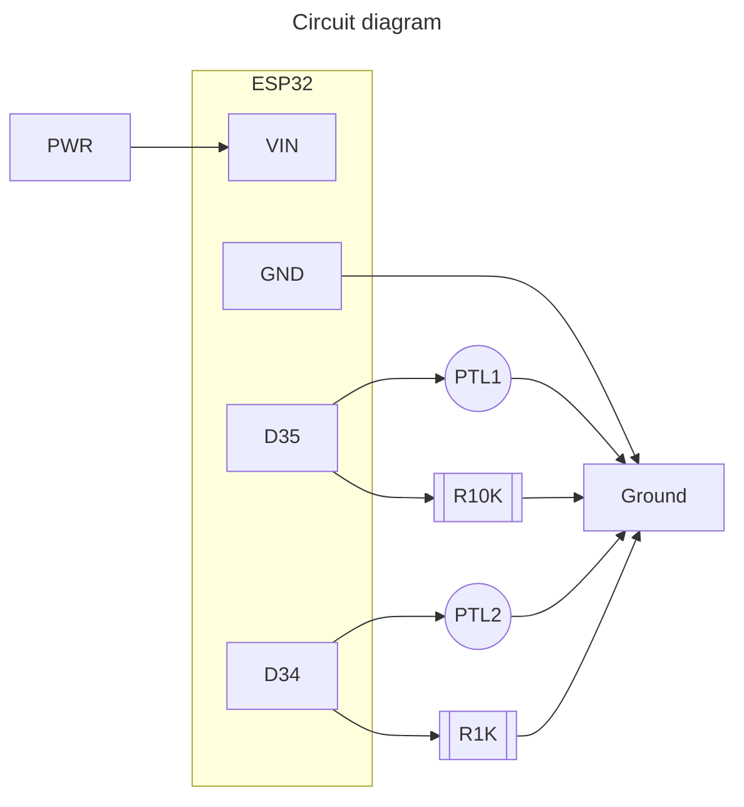

This project reads values from two phototransistors and serves a webpage with the latest values. It is bBased on the tutorial code for the LAFVIN ESP32 Basic Starter Kit, Project 9 ESP32 DHT11 Web Server.

It must be run with an ESP32 wired as shown below. PTL stands for Photo Transistor Light http://adafru.it/2831

