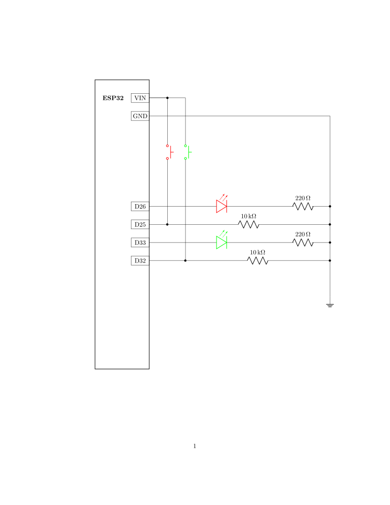

# Two Button Input

The circuit board will have two buttons and two LEDs wired to the ESP. One LED-button pair is for channel 1 and the other LED-button pair is for channel 2.

The ESP sends a low or a high signal for each channel once per second. Both signals start off low, and the LEDs are off. When the button is pressed for a channel that is low, the LED turns on, and a high signal is sent for that channel until the button is pressed again. Then the LED turns off and the low signal is sent again.

This program is meant to be run with the ESP wired as shown below:

