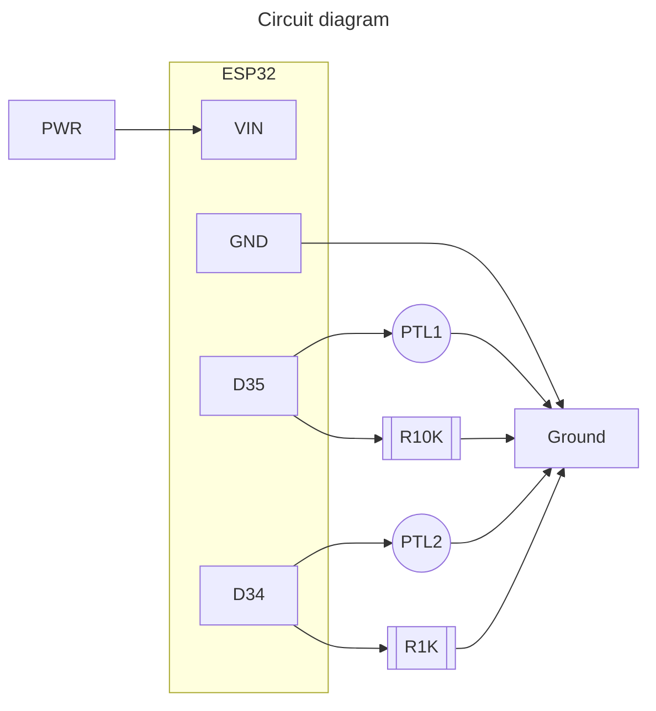

This project reads values from two phototransistors and sends the values to the Adafruit IO server. 

It must be run with an ESP32 wired as shown below. PTL stands for Photo Transistor Light http://adafru.it/2831

